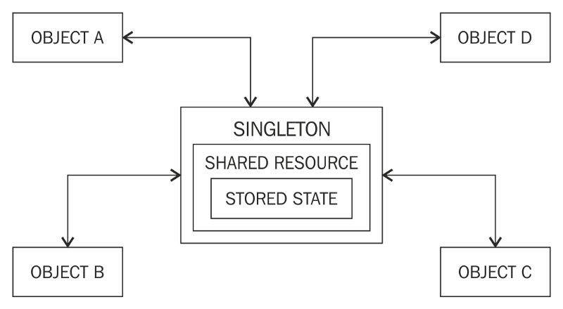

# Singleton Cheat Sheet

## Was ist das Singleton Design Pattern?

Beim Singleton-Design-Pattern wird sichergestellt, dass eine Klasse nur eine einzige Instanz hat und dass diese Instanz
von überall im Code global zugänglich ist. Wenn versucht wird, eine weitere Instanz dieser Klasse zu erstellen, wird
stattdessen auf die bereits bestehende Instanz verwiesen. Das bedeutet, dass eine zentrale Verwaltung von Ressourcen und
Zuständen durch ein Objekt ermöglicht wird.



### Pseudo Code Example

````mermaid
classDiagram
    class Singleton {
        -static Singleton instance
        -Singleton()
        +static Singleton getInstance()
    }
    Singleton : +getInstance() Singleton
    Singleton : -Singleton()
````

```java
class Singleton:

    private static instance: Singleton


    private constructor():
        // Initiate

    public static method getInstance() -> Singleton:
        if instance is null:

            instance = new Singleton()
        return instance
```

## Analogien

1. Das Gesetzbuch eines Landes, welches alle Gesetze und Vorschriften enthält. Wie beim Singleton Design Pattern
   erfolgen
   alle rechtlichen Referenzen auf das eine Buch.
2. In einem Raum gibt es nur einen Lichtschalter, somit erfolgen alle Steuerungen für das Licht über diesen einen
   Schalter.
3. Der einzige Zugang zu einem Bürgerbüro.

## Nachteile und Probleme von Singleton

### 1. Problem: Fast unmöglich zu testen

Durch die globale Natur eines Singletons gestalten sich unabhängig und isolierte Tests zu gestalten als äußerst
schwierig.
Mögliche Probleme beim Testen könnten sein:

1. Der Zustand des Singleton kann zwischen Tests bestehen bleiben.
2. Singleton Instanz kann schwierig gemockt werden.
3. Fehlende Flexibilität bei Unit-Tests, da der Singleton eine feste Instanz ist.

### 2. Problem: Förderung einer globalen Instanz

Globale Verfügbarkeit fördert Abhängigkeiten, was die Modularität verringert und gerade das Refactoring erschwert.
Insbesondere können Abhängigkeiten schwer verfolgt und kontrolliert werden.

### 3. Problem: Verstößt gegen das Single-Responsibility Prinzip

Das Single-Responsibility Prinzip gehört zu den SOLID Design Prinzipien und sagt aus, dass eine Klasse sich nur um eine
Art von Funktionalität kümmern sollte. Ein Singleton hat mindestens 2 Aufgaben. Seine Kernaufgabe (Business-Logic),
sowie die Steuerung der Lebensdauer.

## Vorteile und Anwendungsgebiete von Singleton

### 1. Effizientes Ressourcenmanagement

Eine einzige Instanz einer Klasse spart Ressourcen. Dies wird insbesondere bei großen und ressourcenintensiven Klassen
mit großen Datenmengen sichtbar.

### 2. Globale Zugänglichkeit

Die Zugänglichkeit wird erleichtert durch die globale Natur eines Singletons. So bietet ein Singleton eine einfache
Schnittstelle für zentrale Aufgaben.

### 3. Konsistenz und Einmaligkeit

Das Singleton-Muster garantiert, dass es nur eine Instanz der Klasse gibt. Dies stellt sicher, dass die Zustände und
Daten der Instanz konsistent bleiben, da alle Teile des Programms dieselbe Instanz verwenden.

### Anwendungsgebiete

1. Datenbankverbindungen
2. Logging
3. Cache-Systeme

### Arten des Singleton-Entwurfmusters

#### Lazy Initialisation:

Bei der Lazy Initialisation wird die Instanz erst dann erstellt, wenn sie zum ersten Mal benötigt wird. Dies spart
Ressourcen, da die Instanz nicht sofort beim Programmstart erstellt wird.

```java
class Singleton {
    private static Singleton instance;

    private Singleton() {
        // Initiate
    }

    public static Singleton getInstance() {
        if (instance == null) {
            instance = new Singleton();
        }
        return instance;
    }
}
```

#### Eager Initialisation:

Bei der Eager Initialisation wird die Instanz sofort beim Laden der Klasse erstellt. Dies kann nützlich sein, wenn die
Instanz sofort benötigt wird und die Initialisierung nicht ressourcenintensiv ist.

```java
class Singleton {
    private static final Singleton instance = new Singleton();

    private Singleton() {
        // Initiate
    }

    public static Singleton getInstance() {
        return instance;
    }
}
```

### Singleton - ein Anti-Pattern?

Aufgrund der vielen Nachteile wird das Singleton-Entwurfsmuster in vielen Kreisen auch als Anti-Pattern bezeichnet. Dies
liegt daran, dass dieses Pattern dem Benutzer viele Einschränkungen auferlegt, insbesondere beim Testen und
Multithreading Umgebungen.

### Quiz Link (am Ende bearbeiten!)

https://take.quiz-maker.com/Q5Q2LF5K6

### Helpful Links

https://www.javier8a.com/itc/bd1/articulo.pdf - Design Patterns - Elements of Reusable Object-Oriented Software


